# RSFGA Architecture Diagrams (C4 Model)

## Overview

This document provides architecture diagrams following the [C4 model](https://c4model.com/):
1. **System Context**: How RSFGA fits in the broader ecosystem
2. **Container**: High-level components and technology choices
3. **Component**: Detailed component interactions
4. **Code**: Key classes and relationships

Diagrams are provided in both **Mermaid** (for GitHub rendering) and **PlantUML** formats.

---

## Level 1: System Context Diagram

Shows RSFGA in the context of its users and external systems.

### Mermaid


### PlantUML

```plantuml
@startuml C4_Context
!include https://raw.githubusercontent.com/plantuml-stdlib/C4-PlantUML/master/C4_Context.puml

LAYOUT_WITH_LEGEND()

title System Context Diagram for RSFGA

Person(user, "Application User", "End user of applications")
Person(admin, "Administrator", "Manages RSFGA")
Person(developer, "Developer", "Integrates RSFGA")

System(rsfga, "RSFGA", "High-performance authorization system")

System_Ext(app, "Client Apps", "Applications using RSFGA")
System_Ext(db, "PostgreSQL", "Authorization data store")
System_Ext(cache, "Valkey", "Precomputed results cache")
System_Ext(nats, "NATS", "Edge sync message bus")
System_Ext(metrics, "Prometheus", "Metrics & alerting")
System_Ext(tracing, "Jaeger", "Distributed tracing")

Rel(user, app, "Uses")
Rel(app, rsfga, "Check permissions", "HTTP/gRPC")
Rel(developer, rsfga, "Integrates", "SDK")
Rel(admin, rsfga, "Manages", "Admin API")

Rel(rsfga, db, "Store/Query", "SQL")
Rel(rsfga, cache, "Cache", "Redis")
Rel(rsfga, nats, "Publish", "NATS")
Rel(rsfga, metrics, "Metrics")
Rel(rsfga, tracing, "Traces")

@enduml
```

---

## Level 2: Container Diagram

Shows the major containers (processes/deployments) within RSFGA.

### Mermaid


### PlantUML

```plantuml
@startuml C4_Container
!include https://raw.githubusercontent.com/plantuml-stdlib/C4-PlantUML/master/C4_Container.puml

LAYOUT_WITH_LEGEND()

title Container Diagram for RSFGA

Person(app, "Client App")

System_Boundary(rsfga, "RSFGA") {
    Container(api, "API Server", "Rust, Axum/Tonic", "HTTP/gRPC APIs")
    Container(worker, "Precompute Worker", "Rust, Tokio", "Background computation")
    Container(edge, "Edge Node", "Rust", "Edge deployment")

    ContainerDb(cache_l1, "L1 Cache", "DashMap", "In-memory cache")
    ContainerDb(edge_db, "Edge DB", "RocksDB", "Local storage")
}

ContainerDb(db, "PostgreSQL", "Authorization data")
ContainerDb(cache_l2, "Valkey", "Precomputed cache")
Container(nats, "NATS", "Message bus")
System_Ext(metrics, "Prometheus")
System_Ext(tracing, "Jaeger")

Rel(app, api, "Check/Write", "HTTP/gRPC")
Rel(api, cache_l1, "Read")
Rel(api, db, "SQL")
Rel(api, cache_l2, "Redis")
Rel(api, nats, "Publish")
Rel(api, metrics, "Metrics")
Rel(api, tracing, "Traces")

Rel(worker, db, "Read")
Rel(worker, cache_l2, "Write")
Rel(worker, nats, "Subscribe")

Rel(edge, api, "Fallback")
Rel(edge, nats, "Leaf")
Rel(edge, edge_db, "Query")

@enduml
```

---

## Level 3: Component Diagram - API Server

Shows internal components of the API Server.

### Mermaid


### Diagram: Request Flow

```mermaid
sequenceDiagram
    participant Client
    participant HTTP as HTTP Handler
    participant Auth as Auth Middleware
    participant Rate as Rate Limiter
    participant Check as Check Handler
    participant Cache as Check Cache
    participant Resolver as Graph Resolver
    participant DB as PostgreSQL

    Client->>HTTP: POST /check
    HTTP->>Auth: Validate token
    Auth->>Rate: Check rate limit
    Rate->>Check: Handle request

    Check->>Cache: Lookup cache key
    alt Cache Hit
        Cache-->>Check: Return cached result
        Check-->>HTTP: Response
    else Cache Miss
        Check->>Resolver: Resolve check
        Resolver->>DB: Query tuples
        DB-->>Resolver: Tuples
        Resolver->>Resolver: Traverse graph
        Resolver-->>Check: Result
        Check->>Cache: Store result
        Check-->>HTTP: Response
    end

    HTTP-->>Client: 200 OK {allowed: true}
```



---

## Level 3: Component Diagram - Graph Resolver

Shows the graph resolution algorithm components.

### Mermaid


---

## Level 4: Code Diagram - Core Structures

Key classes and their relationships.

### PlantUML Class Diagram


---

## Deployment Diagram - Multi-Region Edge

### Mermaid


---

## Data Flow Diagram - Write Operation


---

## Data Flow Diagram - Check Operation (with Precomputation)


---

## Summary

These diagrams provide complete architectural views of RSFGA:

- **C4 Level 1 (Context)**: System in ecosystem
- **C4 Level 2 (Container)**: Major deployable units
- **C4 Level 3 (Component)**: Internal components
- **C4 Level 4 (Code)**: Key classes and relationships
- **Deployment**: Multi-region edge architecture
- **Data Flow**: Write and check operations

All diagrams are provided in Mermaid (GitHub-compatible) and PlantUML formats.

**Tools**:
- Mermaid: View directly in GitHub/IDEs with Mermaid support
- PlantUML: Use [PlantUML Online](http://www.plantuml.com/plantuml/uml/) or local tools

**Next**: See [ROADMAP.md](./ROADMAP.md) for implementation plan.
