# Leopard Pre-computation Architecture Diagrams

## 1. System Architecture (Mermaid)

### 1.1 Overall System Architecture

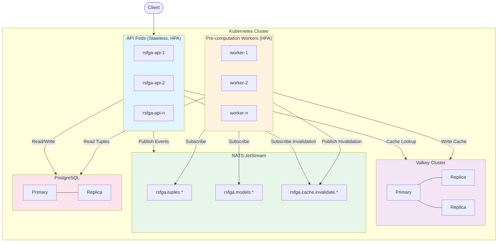

### 1.2 Cache Tier Architecture

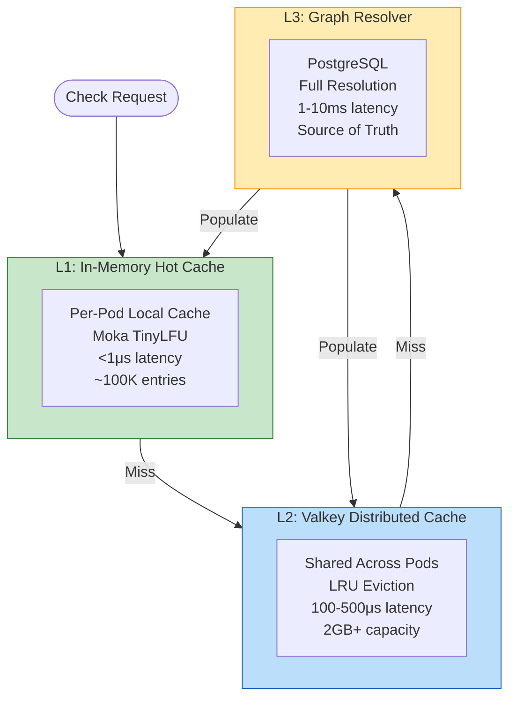

### 1.3 Write Path Flow

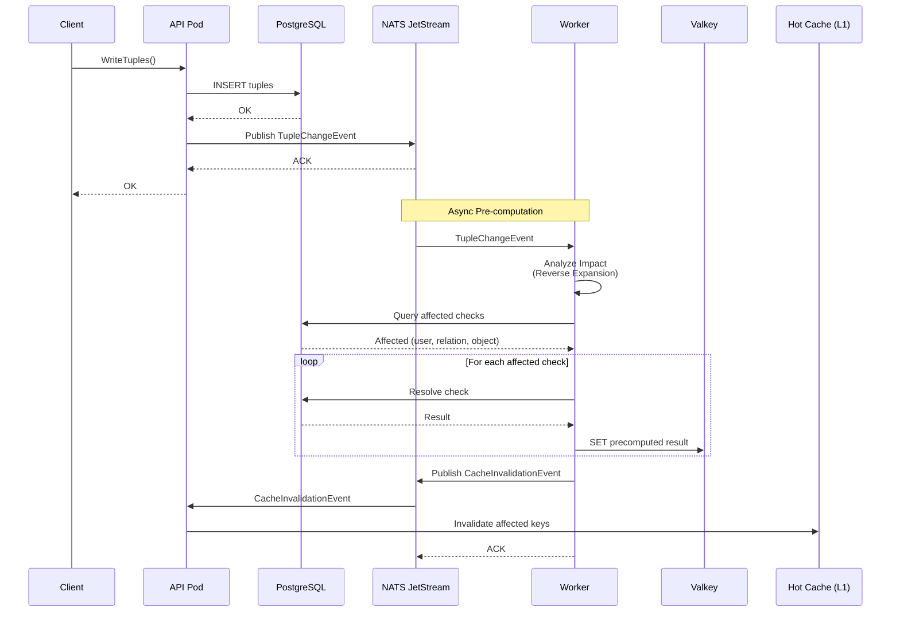

### 1.4 Read Path Flow

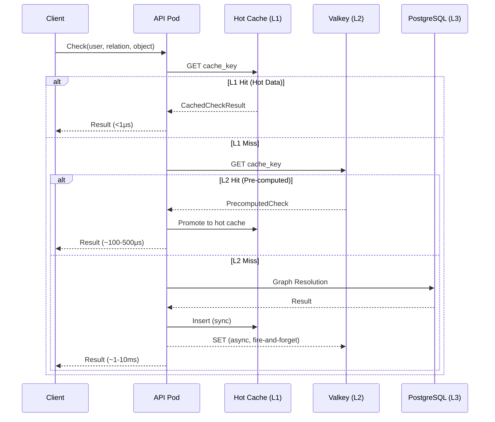

### 1.5 Pre-computation Worker Flow

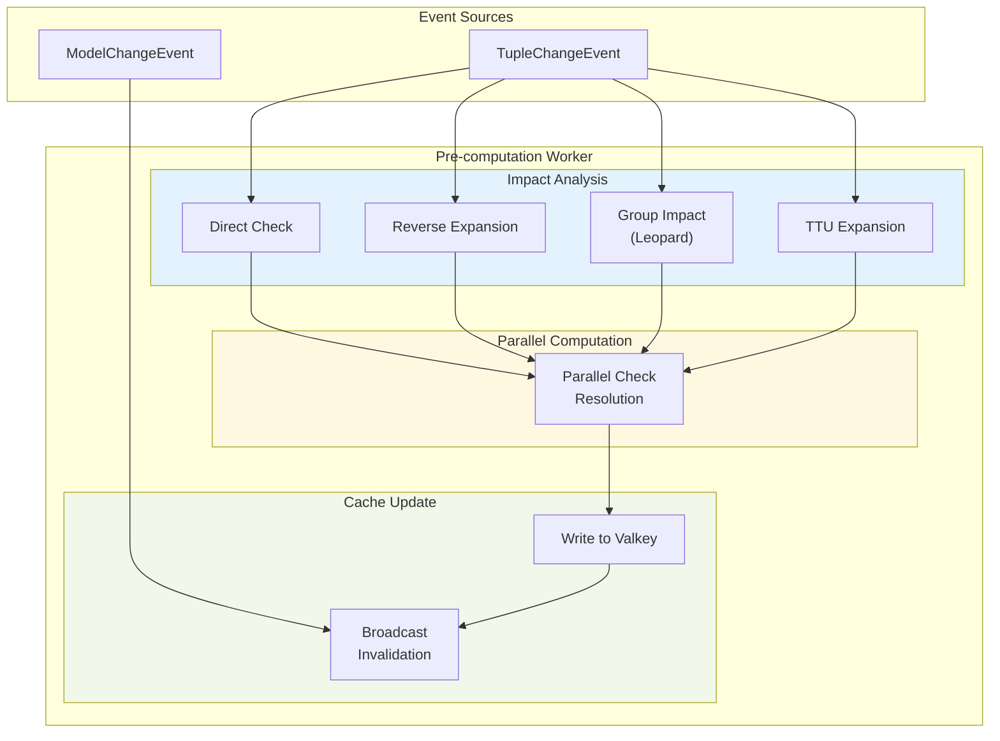

### 1.6 Hot Cache Invalidation Flow

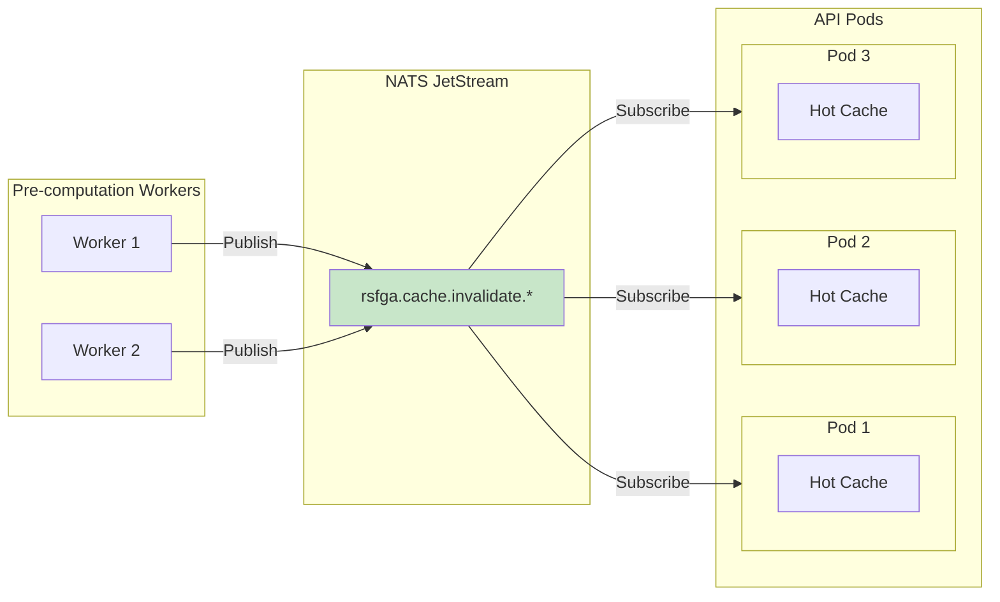

---

## 2. Component Diagrams (Mermaid)

### 2.1 API Pod Components

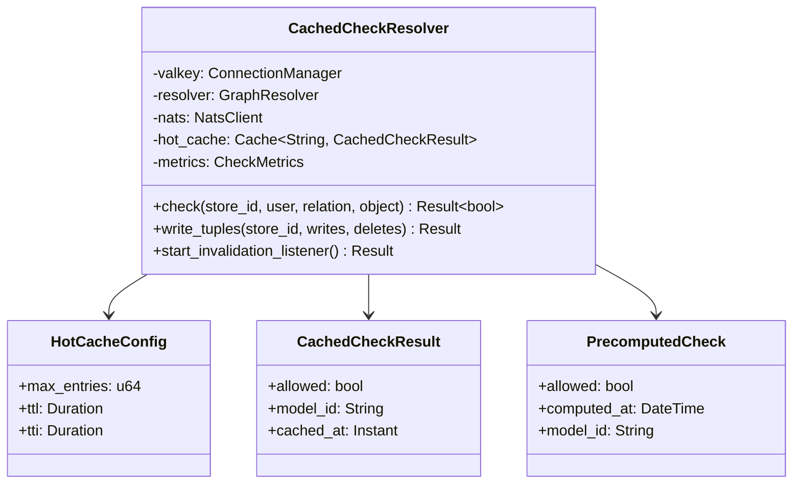

### 2.2 Worker Components

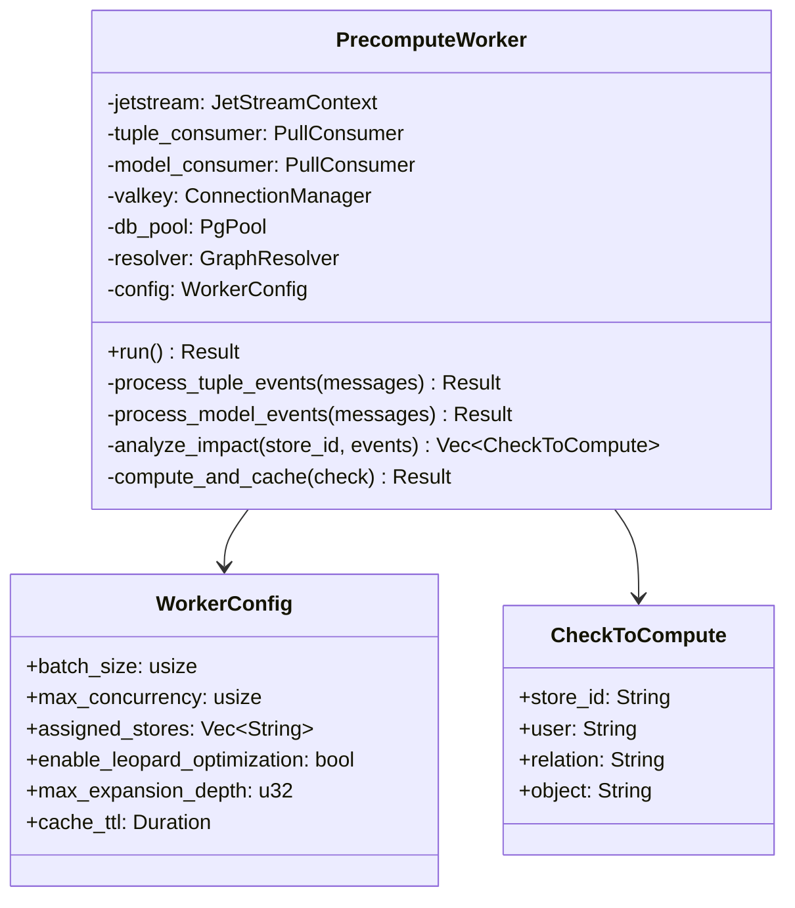

### 2.3 Event Schema

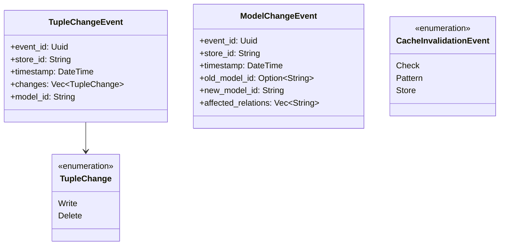

---

## 3. Deployment Architecture (Mermaid)

### 3.1 Kubernetes Deployment

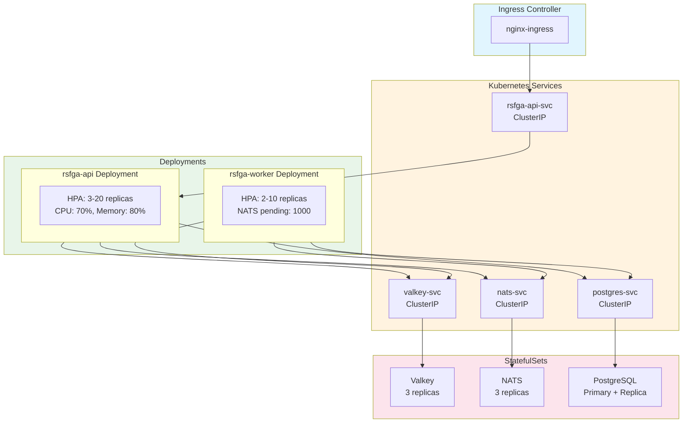

---

## 4. Data Flow Diagrams (Mermaid)

### 4.1 Leopard Group Membership Expansion

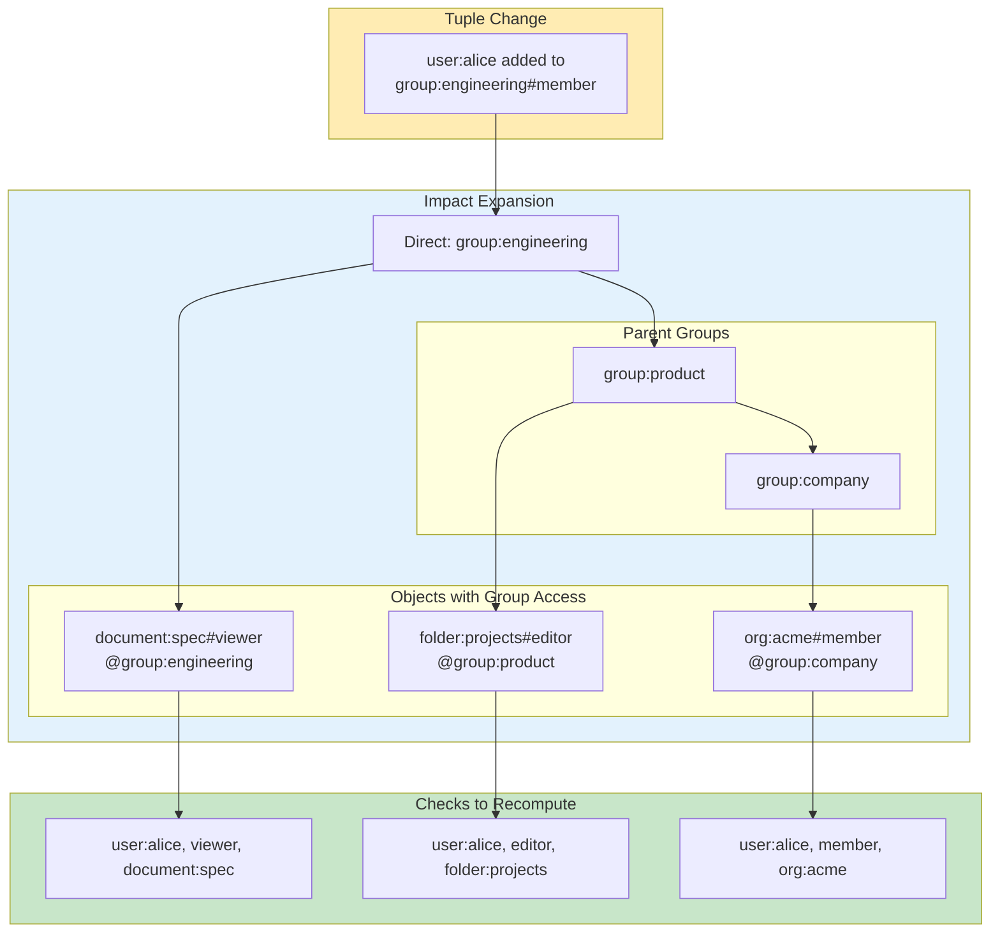

### 4.2 Model Change Invalidation

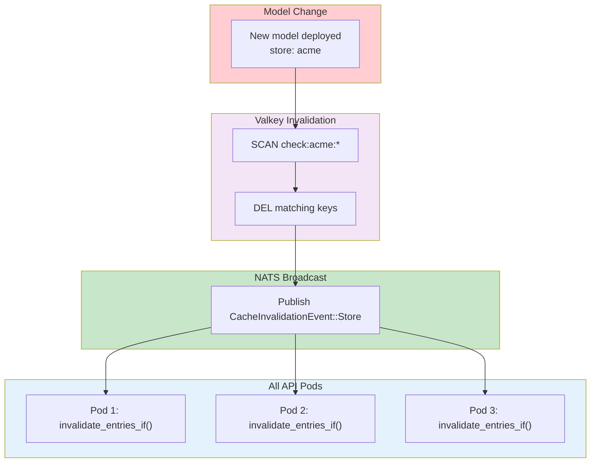
